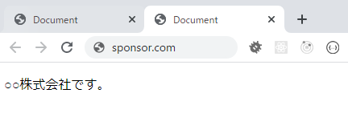

バーナーとかで他サイトと連携することが普通だが、無害と考えているのに、不注意すると脆弱性がでてくることはご存じですか。\
意外と見逃しがちの攻撃なので、メモしておきます。

## 問題
**a**タグで他サイトへ遷移する時に、遷移先ページでは現ページの`location`オブジェクトにアクセスができてしまって、\
悪質なアクションを行うことができる。

## 具体的どんなことが起こりえる
1. あなたのサイトに他サイト遷移のリンク配置
2. ユーザーはリンクをクリックして、新しいタブで開く
3. ユーザーはあなたのサイトのタブに戻る  \
**3**は知らないうちに、あなたとのそっくりページが表示されている！！！

1. あなとのサイトへアクセスする\

2. **スポンサーページ**をクリックし、**○○株式会社**サイトへアクセスする\

3. **1**のタブに戻って、**ログイン**をする\

ここで変わった点を気づいたか
- リンクURL：**yoursite.com** -> **y0ursite.com**
- 画面がそっくりだね。（デモの目的でメッセージを出したけど）

## 対策
- **a**タグに **rel="noopener noreferrer"** 属性を追加

## まとめ
- 外部ページへアクセスするリンクは全て**rel="noopener noreferrer"**に設定すること
- 本脆弱性は自サイトの問題ではなく、連携先側で攻撃を受けられた際、悪影響を及ぼす対策の必要なものである。
